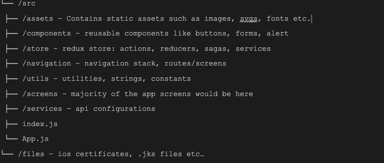

# React-Native-Code-Standard-Demo

This repository maintain standard structure and code best practices for React Native. It is always good to follow standard format to maintain quality code while working in Team.

## Files and Folders

<p style="margin-top:20px">
    
</p>

## Naming Conventions
- Component’s names should be written using a pascal case:
  1. Header.js
  2. HeroBanner.js
- Non-components should be written using a camel case. 
  1. myUtilityFile.js
  2. cookieHelper.js
  3. fetchApi.js
- CSS files should be named the same as the component PascalCase. Global CSS which applies to all components should be placed in global.css and should be named in camelCase
  1. LoginScreen.css(for components), global.css(for global styles)
- Attribute name should be camel case:
  1. className
  2. onClick
- Variable names should be camel case:
  1. const variable = 'test';
  2. let variableBoolean = true;


## Putting imports in an order
- Putting imports in an order
  1. React import
  2. Library imports 
  3. Absolute imports from the project 
  4. Relative imports
  5. Import * as
  6. Import ‘./<some file>.<some extension>
  <br />
Each kind should be separated by an empty line. This makes your imports clean and easy to understand for all the components, 3rd-party libraries, and etc.


## Layout Conventions
- Always end a statement with a semicolon.
- Not allowing to set a state to be invoked on Render() of a React Component.
- Add at least one blank line between method and property definitions.
- There should be no line space between two similar looking statements or similar bunch of code applies to the same activity.

      const [loading, setLoading] = useState(false);
      const [name, setName] = useState(John);
      const [age, setAge] = useState(‘22’);

      And

      if (apiInProgress){
        setLoading(true);
        setName(null);
      }


## Commenting Conventions
- Place the comment on a separate line, not at the end of a line of code.
- Begin comment text with an uppercase letter.
- End comment text with a period.
- Insert one space between the comment delimiter (//) and the comment text.
- Attach comments to code only where necessary.


## Don’t Repeat Yourself
  One of the basic principles of software development is Don’t Repeat Yourself. We must not write the same piece of code twice. Whenever you write the same piece of code twice, you must try to refactor it into something reusable, even if not completely.

  You can create your own reusable components. For example, if your app contains multiple input fields, you can create a reusable `<TextInput>` component and use it across any screen within your app. Not only input fields, if your app contains multiple buttons, but you can also create a reusable `<Button>` component and use it anywhere within your app. Likewise, you can create any number of reusable components based on your app architecture.


## Avoid Inline Styling
  Using inline stylings is much harder to maintain if a change is to be made there will be hundreds of places in the code you will have to search and change unless all styles are clearly defined with unique class names in a CSS stylesheet. For any property you want to change, you would have to simply modify the corresponding class name properties in the stylesheet, all the div/view that use the class name will be affected.

  A well-defined stylesheet is extremely helpful while building complex React Native apps. Use React Native Stylesheet object to add styles specific to a certain component.


## Exception Handling
  One of the worst user experiences is using a mobile application that crashes with errors that aren’t handled gracefully. So, exception handling plays an important role in making your app run smoothly.

  We use the try and catch blocks to handle exceptions within a React Native app.

  The try…catch statement marks a block of statements to try, and specifies one or more responses should an exception be thrown. If an exception is thrown, the try…catch statement catches it.

  The try…catch statement consists of a try block, which contains one or more statements, and a catch block, containing statements that specify what to do if an exception is thrown in the try block.

  If your app consists of a block of code that may throw exceptions, you can handle that in a try-catch block like shown below.

  ```
  try {
      throw new Error("Error");
  } catch (error) {
      // handle Error
  }
  ```


## Always Perform Both Local and Server Validations

  Although, there are some validations or tests which only the server can validate, such as if the entered username or password exists in the database or if the entered email exists in the database. But it is a best practice that you always implement as much client validation as possible, such as entering the proper email format, empty field validation and also a minimum or maximum number of characters required. So, it is always preferable to perform both local and server validations.


## Remove console logs in the release build

  Having many console.log statements can slow your app down, especially if you are using logging libraries such as redux-logger. Be sure to disable all logs (manually or with a script) when doing a release build.


## Use a linter to make your code easier to review
  Follow strict linting rules. This in turn helps you write clean, consistent code.


## Review your code before creating a pull/merge request.
  Review your code at least once before creating a pull or merge request


## Basic Rules

- Create multiple files instead of writing a big file.
- Split your code into multiple smaller functions. Each with a single responsibility.
- Name your files logically according to the job that they perform.
- Clean code is self-commenting(using the right variable names and function names). Use comments only to explain complex functions.
- Destructuring your props is a good way to help make your coder cleaner and more maintainable.
- Use index.js for each folder to export (Avoid repeating names on the imports)
- Always use prop-types to define all the props in your components. prop-types is runtime type checking for React props and similar objects
- Add at least one blank line between methods.
- Commented out code should be deleted, not committed.
- Remove unused code.
